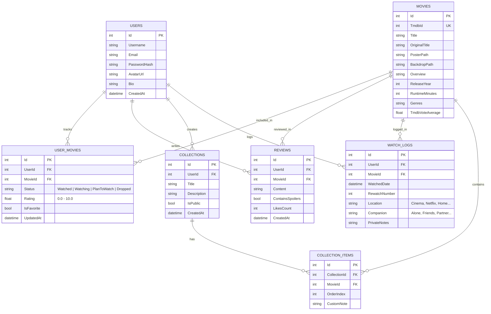

# 🎬 Tài Liệu Ý Tưởng & Đặc Tả Tính Năng - MovieTracker App

> **MovieTracker** là ứng dụng cá nhân hóa trải nghiệm theo dõi, lưu trữ và khám phá điện ảnh. Ứng dụng giúp người dùng ghi lại hành trình xem phim, đánh giá cảm nhận, khám phá phim mới và xem lại các thống kê điện ảnh thú vị của bản thân.

---

## 📑 Mục Lục
1. [Tầm Nhìn & Đối Tượng Sử Dụng](#1-tầm-nhìn--đối-tượng-sử-dụng)
2. [Ma Trận Ưu Tiên Tính Năng (MoSCoW)](#2-ma-trận-ưu-tiên-tính-năng-moscow)
3. [Chi Tiết Các Nhóm Tính Năng](#3-chi-tiết-các-nhóm-tính-năng)
   - [3.1. Quản Lý Theo Dõi & Nhật Ký Xem (Core Tracking)](#31-quản-lý-theo-dõi--nhật-ký-xem-core-tracking)
   - [3.2. Đánh Giá, Cảm Nhận & Ghi Chú Cá Nhân (Reviews & Notes)](#32-đánh-giá-cảm-nhận--ghi-chú-cá-nhân-reviews--notes)
   - [3.3. Tích Hợp API Dữ Liệu Điện Ảnh (TMDB / IMDb)](#33-tích-hợp-api-dữ-liệu-điện-ảnh-tmdb--imdb)
   - [3.4. Bộ Sưu Tập & Danh Sách Tùy Biến (Custom Lists)](#34-bộ-sưu-tập--danh-sách-tùy-biến-custom-lists)
   - [3.5. Thống Kê & Báo Cáo Thị Giác (Analytics & "Movie Wrapped")](#35-thống-kê--báo-cáo-thị-giác-analytics--movie-wrapped)
   - [3.6. Khám Phá & Gợi Ý Thông Minh (AI / Recommendation)](#36-khám-phá--gợi-ý-thông-minh-ai--recommendation)
   - [3.7. Tính Năng Xã Hội & Chia Sẻ (Social & Community)](#37-tính-năng-xã-hội--chia-sẻ-social--community)
   - [3.8. Gamification & Huy Hiệu (Badges & Challenges)](#38-gamification--huy-hiệu-badges--challenges)
4. [Mô Hình Dữ Liệu Tham Khảo (Database Entities)](#4-mô-hình-dữ-liệu-tham-khảo-database-entities)
5. [Lộ Trình Triển Khai Đề Xuất (Phased Roadmap)](#5-lộ-trình-triển-khai-đề-xuất-phased-roadmap)

---

## 1. Tầm Nhìn & Đối Tượng Sử Dụng

### 🎯 Tầm nhìn
Trở thành cuốn **"Nhật ký điện ảnh bỏ túi"** vừa hiện đại, mượt mà vừa giàu cảm xúc cho người yêu phim, giải quyết các vấn đề:
- Hay quên những bộ phim đã xem hoặc đang xem dở.
- Muốn lưu lại cảm xúc, điểm số và câu trích dẫn yêu thích ngay sau khi xem.
- Tìm kiếm câu trả lời nhanh chóng cho câu hỏi: *"Tối nay xem phim gì?"*.
- Tự hào chia sẻ gu phim và thống kê xem phim của bản thân với bạn bè.

### 👥 Đối tượng người dùng mục tiêu
- **Người xem phổ thông**: Cần một nơi gọn gàng để ghi lại danh sách phim muốn xem (Watchlist) và phim đã xem.
- **Mọt phim (Cinephile)**: Quan tâm sâu đến đạo diễn, dàn cast, năm sản xuất, muốn viết review chi tiết, chấm điểm theo nhiều tiêu chí và theo dõi số giờ xem.
- **Người thích cày phim bộ (Series Binge-watcher)**: Cần theo dõi từng tập (Season / Episode), không nhớ mình đã xem đến tập mấy.

---

## 2. Ma Trận Ưu Tiên Tính Năng (MoSCoW)

| Nhóm | Tính năng | Mục tiêu |
| :--- | :--- | :--- |
| **Must Have** *(Bắt buộc)* | - Đăng ký, đăng nhập (JWT, bảo mật tài khoản). - Tìm kiếm phim tự động qua **TMDB API** (lấy poster, thông tin, diễn viên). - Đánh dấu trạng thái: **Đã xem (Watched)** / **Muốn xem (Watchlist)**. - Chấm điểm (Rating 1-10 sao hoặc 1-5 sao có nửa sao). - Quản lý danh sách cá nhân (CRUD, tìm kiếm, lọc theo thể loại/năm). | MVP hoạt động mượt mà, người dùng nhập liệu nhanh không cần gõ thủ công. |
| **Should Have** *(Nên có)* | - Nhật ký xem (Xem ngày nào, xem lại bao nhiêu lần - Rewatch count). - Viết review ngắn + Cảnh báo Spoiler. - Tạo Bộ sưu tập tùy biến (Custom Collections, ví dụ: "Top 10 phim plot twist"). - Thống kê cơ bản (Tổng phim đã xem, tổng thời lượng, thể loại xem nhiều nhất). - Theo dõi tiến độ phim bộ (Season/Episode tracker). | Tăng chiều sâu trải nghiệm, biến app thành nhật ký thực thụ. |
| **Could Have** *(Mở rộng thú vị)* | - **Movie Wrapped cuối năm** (tổng kết gu phim dạng story chia sẻ mạng xã hội). - Gợi ý phim thông minh / Vòng quay may mắn ("Tối nay xem gì?"). - Thông tin "Xem ở đâu?" (Streaming Providers: Netflix, VieON, FPT Play qua JustWatch/TMDB). - Xuất thẻ phim (Movie Card) dạng hình ảnh đẹp mắt để đăng Story Instagram/Facebook. - Nhập/Xuất dữ liệu (Import từ Letterboxd, IMDb, file CSV). | Tạo điểm nhấn viral, thu hút người dùng chia sẻ lên mạng xã hội. |
| **Won't Have (Giai đoạn đầu)** | - Xem phim trực tiếp trên web (vi phạm bản quyền & chi phí streaming lớn). - Mạng xã hội phức tạp như diễn đàn chat trực tiếp. | Tập trung vào bài toán cốt lõi là **Quản lý & Nhật ký**. |

---

## 3. Chi Tiết Các Nhóm Tính Năng

### 3.1. Quản Lý Theo Dõi & Nhật Ký Xem (Core Tracking)
- **Hệ thống trạng thái linh hoạt:**
  - 🟢 **Đã xem (Watched)**: Đã hoàn thành bộ phim.
  - 🟡 **Đang xem (Watching)**: Đặc biệt hữu ích cho phim bộ (đang ở Season X, Episode Y).
  - 🔵 **Muốn xem (Plan to Watch / Watchlist)**: Danh sách phim chờ xem khi rảnh rỗi.
  - ⚪ **Tạm dừng (On Hold)**: Đang bận hoặc dừng theo dõi tạm thời.
  - 🔴 **Bỏ dở (Dropped)**: Phim không hợp gu, ngừng xem giữa chừng kèm lý do (tùy chọn).
- **Nhật ký xem phim (Viewing Diary / Log):**
  - Ghi nhận ngày/giờ xem phim (có thể chọn ngày trong quá khứ).
  - Đánh dấu **Xem lại (Rewatch)**: Đếm số lần xem (ví dụ: *Interstellar xem lần thứ 4*).
  - Nơi xem: Rạp chiếu phim (CGV, Lotte, BHD...), Netflix, Ở nhà, Bạn bè...
  - Người cùng xem: Xem một mình, cùng người yêu, gia đình hay nhóm bạn.
- **Theo dõi phim bộ chi tiết (TV Show Episode Tracking):**
  - Check-in từng tập đã xem.
  - Thanh tiến độ trực quan: `Đã xem 8/12 tập (67%)`.
  - Tự động nhảy sang tập tiếp theo sau khi đánh dấu xong một tập.

---

### 3.2. Đánh Giá, Cảm Nhận & Ghi Chú Cá Nhân (Reviews & Notes)
- **Hệ thống chấm điểm đa dạng:**
  - Chấm điểm tổng quan: Thang 10 điểm (kèm 0.5 lẻ) hoặc thang 5 sao.
  - *(Nâng cao)* Chấm điểm thành phần:
    - 🎭 Diễn xuất (Acting)
    - 📖 Cốt truyện / Kịch bản (Plot / Screenplay)
    - 🎵 Âm nhạc & Âm thanh (Soundtrack & Sound Design)
    - 🎨 Kỹ xảo & Hình ảnh (Visual & Cinematography)
- **Đánh giá & Cảnh báo Spoilers:**
  - Trình soạn thảo review (hỗ trợ định dạng cơ bản: in đậm, trích dẫn).
  - Tùy chọn **"Chứa nội dung tiết lộ (Contains Spoilers)"**: Khi bật, nội dung review sẽ bị mờ đi cho đến khi người xem bấm "Hiển thị".
- **Ghi chú riêng tư (Private Journal):**
  - Phần ghi chú chỉ một mình người dùng thấy (ví dụ: *Bộ phim này gắn với kỷ niệm lần đầu hẹn hò...*).
  - Lưu lại câu thoại tâm đắc (Favorite Quotes) trong phim.
- **Gắn Tag cảm xúc (Mood Tags):**
  - Gắn nhãn cảm xúc sau khi xem: `#CảmĐộng`, `#KhócHếtNướcMắt`, `#HạiNão`, `#ChillCuốiTuần`, `#HồiHộp`, `#PlotTwist`.

---

### 3.3. Tích Hợp API Dữ Liệu Điện Ảnh (TMDB / IMDb)
- **Tìm kiếm thông minh (Auto-complete & Search):**
  - Tích hợp **The Movie Database (TMDB API)**: Người dùng chỉ cần gõ tên phim (tiếng Việt hoặc tiếng Anh), hệ thống tự động gợi ý danh sách kèm poster, năm phát hành.
  - Tự động đồng bộ các dữ liệu quan trọng:
    - Tên gốc, tên tiếng Việt.
    - Poster dọc (Poster) & Poster ngang độ phân giải cao (Backdrop).
    - Tóm tắt nội dung (Overview).
    - Thời lượng (Runtime), Thể loại (Genres), Quốc gia sản xuất, Ngày công chiếu.
    - Đạo diễn (Director), Biên kịch, Dàn diễn viên chính kèm ảnh chân dung.
    - Trailer chính thức (nhúng trực tiếp video YouTube).
- **Thông tin "Xem ở đâu?" (Streaming Availability):**
  - Tích hợp dịch vụ JustWatch (qua TMDB) hiển thị nền tảng xem hợp pháp tại Việt Nam (Netflix, Apple TV, Google TV, VieON...).

---

### 3.4. Bộ Sưu Tập & Danh Sách Tùy Biến (Custom Lists)
- **Tạo danh sách theo chủ đề:**
  - Ví dụ: *"Top phim trinh thám hack não nhất", "Phim hoạt hình Ghibli yêu thích", "Phim nên xem cùng crush"*.
  - Thêm mô tả cho danh sách, gắn banner đại diện.
  - Sắp xếp thứ tự phim trong danh sách bằng kéo thả (Drag & Drop ranking).
- **Chế độ hiển thị:**
  - Công khai (Public) hoặc Riêng tư (Private).
  - Chia sẻ link bộ sưu tập cho bạn bè mà không cần họ phải đăng nhập.

---

### 3.5. Thống Kê & Báo Cáo Thị Giác (Analytics & "Movie Wrapped")
- **Bảng điều khiển thống kê cá nhân (Personal Dashboard):**
  - ⏱️ **Tổng thời gian đã xem:** Quy đổi ra Giờ & Ngày (ví dụ: *Bạn đã dành 14 ngày 6 giờ cuộc đời để xem phim*).
  - 🎬 **Tổng số phim:** Số phim điện ảnh, số tập phim bộ.
  - 📊 **Biểu đồ thể loại yêu thích (Pie Chart):** Hành động (35%), Khoa học viễn tưởng (25%), Tâm lý (20%)...
  - ⭐ **Biểu đồ phân bổ điểm đánh giá:** Phân tích xem người dùng là người chấm điểm dễ tính hay khó tính.
  - 🧑‍🎨 **Đạo diễn & Diễn viên xem nhiều nhất:** Tự động xếp hạng top 5 gương mặt xuất hiện nhiều nhất trong lịch sử xem.
  - 📅 **Thói quen xem theo thời gian:** Bạn xem phim nhiều nhất vào thứ mấy, khung giờ nào trong ngày.
- **Tính năng "Movie Wrapped" (Tổng kết năm điện ảnh):**
  - Vào cuối năm (hoặc bất kỳ lúc nào), hệ thống tự động tạo bộ thẻ tổng kết đồ họa cực đẹp (giống Spotify Wrapped):
    - *Bộ phim bạn chấm điểm cao nhất năm.*
    - *Đạo diễn truyền cảm hứng nhất cho bạn.*
    - *Số phim bạn đã xem vượt qua X% người dùng khác.*
  - Hỗ trợ xuất ảnh định dạng 9:16 (Story Facebook / Instagram / TikTok) chỉ với 1 click.

---

### 3.6. Khám Phá & Gợi Ý Thông Minh (AI / Recommendation)
- **"Tối nay xem gì?" (Movie Roulette / Wheel of Fortune):**
  - Người dùng đang phân vân không biết xem gì? Hệ thống sẽ quay ngẫu nhiên 1 phim trong danh sách **Muốn xem (Watchlist)** của họ.
  - Bộ lọc nhanh theo hoàn cảnh:
    - *Thời gian rảnh:* Dưới 90 phút / Dưới 2 tiếng / Càng dài càng tốt.
    - *Tâm trạng (Mood):* Đang buồn cần phim hài, Đang chán cần phim giật gân, Cần phim truyền động lực.
- **Gợi ý phim tương tự (Similar Movies):**
  - Dựa trên phim vừa đánh giá 9-10 sao, hệ thống tự động đề xuất 5 phim có cùng chủ đề hoặc cùng phong cách đạo diễn.
- **Trợ lý AI tư vấn phim (Tùy chọn tương lai):**
  - Chatbot tích hợp Gemini: *"Gợi ý cho tôi 3 bộ phim trinh thám Bắc Âu có không khí u ám giống như 'The Girl with the Dragon Tattoo'"*.

---

### 3.7. Tính Năng Xã Hội & Chia Sẻ (Social & Community)
- **Hồ sơ cá nhân (Public Profile):**
  - Trang cá nhân hiển thị: Bio, Top 4 phim yêu thích nhất mọi thời đại (như Letterboxd), thống kê ngắn gọn, các bộ sưu tập công khai.
- **Thẻ phim chia sẻ (Movie Share Card):**
  - Khi xem xong và review 1 bộ phim, người dùng có thể tạo một hình ảnh card bao gồm: Poster phim, số sao đánh giá, trích đoạn review ngắn, tên người dùng.
  - Tải về dạng PNG hoặc share trực tiếp lên mạng xã hội.
- **Chỉ số hợp gu (Taste Compatibility):**
  - So sánh gu phim giữa 2 người bạn: *"Bạn và Hoàng có độ hợp gu điện ảnh lên đến 87%"* (dựa trên các phim cả 2 cùng xem và điểm chấm tương đồng).

---

### 3.8. Gamification & Huy Hiệu (Badges & Challenges)
- **Thử thách xem phim (Movie Challenges):**
  - *Thử thách 52 tuần:* Xem 52 bộ phim trong một năm (1 phim/tuần).
  - *Thử thách Oscar:* Xem hết các đề cử "Phim xuất sắc nhất" của mùa Oscar hiện tại.
- **Hệ thống Huy hiệu (Achievements & Badges):**
  - 🦇 **Cú đêm (Night Owl):** Xem phim trong khung giờ từ 1h - 4h sáng.
  - 🍿 **Marathoner:** Xem liên tục 3 bộ phim trong vòng 24 giờ.
  - 🕵️ **Thám tử tài ba:** Xem và đánh giá trên 20 bộ phim thể loại Trinh thám/Tội phạm.
  - ⏳ **Nhà du hành thời gian:** Xem 1 bộ phim sản xuất trước năm 1970.

---

## 4. Mô Hình Dữ Liệu Tham Khảo (Database Entities)

Để hỗ trợ các tính năng trên, dưới đây là thiết kế các thực thể chính dự kiến cho cơ sở dữ liệu (SQL Server):

---

## 5. Lộ Trình Triển Khai Đề Xuất (Phased Roadmap)

### 🚀 Giai Đoạn 1: Hoàn Thiện MVP Cốt Lõi (Đã Hoàn Thành)
- [x] Hệ thống tài khoản: Đăng ký / Đăng nhập JWT (Backend HttpOnly Cookies).
- [x] Quản lý phim cá nhân thuần túy: Thêm, sửa, xóa phim trực tiếp không phụ thuộc API bên ngoài.
- [x] Phân loại trạng thái: **Đã xem (Watched)** / **Muốn xem (PlanToWatch)** kèm chấm điểm (Rating 1-10 sao).
- [x] Bộ lọc & tìm kiếm thông minh: Lọc theo Tabs trạng thái, đếm số lượng thực tế, tìm kiếm theo tên và thể loại.
- [x] Form nhập liệu đầy đủ: Tên phim, năm phát hành, thể loại gợi ý, link ảnh poster tùy chọn và cảm nhận cá nhân.

### 🌟 Giai Đoạn 2: Trải Nghiệm & Nhật Ký Điện Ảnh (Tuần 3 - Tuần 4)
- [ ] Trang chi tiết phim (Movie Details modal/page): Hiển thị Trailer, dàn diễn viên, tóm tắt cốt truyện.
- [ ] Tính năng **Nhật ký xem phim (Watch Log)**: Ghi lại ngày xem, số lần xem lại (Rewatch).
- [ ] Viết Review và gắn cờ cảnh báo Spoiler.
- [ ] Bộ lọc nâng cao: Lọc phim theo Thể loại, Năm phát hành, Điểm đánh giá cá nhân.
- [ ] Quản lý Bộ sưu tập cá nhân (Custom Lists / Playlists).

### 📊 Giai Đoạn 3: Thống Kê & Cá Nhân Hóa (Tuần 5 - Tuần 6)
- [ ] Dashboard thống kê: Tổng số giờ xem, biểu đồ thể loại yêu thích, đạo diễn xem nhiều nhất.
- [ ] Tính năng "Tối nay xem gì?": Vòng quay may mắn chọn ngẫu nhiên từ Watchlist.
- [ ] Hỗ trợ xem phim bộ (TV Series): Đánh dấu từng tập (Episode tracking).
- [ ] Xuất ảnh thẻ đánh giá phim (Movie Card) để chia sẻ lên mạng xã hội.

### 🌐 Giai Đoạn 4: Cộng Đồng & Nâng Cao (Tương lai)
- [ ] Trang cá nhân công khai (Public Profile) và Top 4 phim yêu thích.
- [ ] Báo cáo tổng kết năm **Movie Wrapped**.
- [ ] Nhập dữ liệu tự động từ file CSV của Letterboxd hoặc IMDb.
- [ ] Tích hợp PWA (Progressive Web App) để cài đặt trên điện thoại như ứng dụng native.

---

> 💡 **Khuyến nghị tiếp theo**: Để bắt đầu ngay, chúng ta nên triển khai tích hợp **TMDB API** cho Backend và tạo Model `Movie` / `UserMovie` để thay thế dữ liệu Mock hiện tại trên Frontend.
